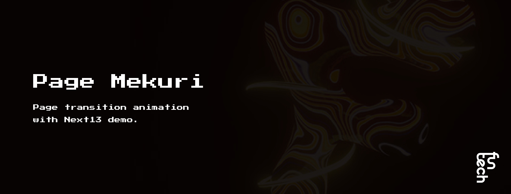

# Page Mekuri

page-mekuri is a demo for creating page transition animations in the app directory of Next13. It allows you to do page transition animations without using DOM libraries like React-transition-group, framer motion, or react-spring. It also supports wait and sync modes, as well as popstate (saving scroll position at the time of popstate, also known as scroll restoration). Since animations can be set per component, you can flexibly implement them using animation libraries like gsap.

[Docs](https://funtech-inc.notion.site/docs-2fc596dbda464b41a0efc22b2fc7a4ee?pvs=4)
