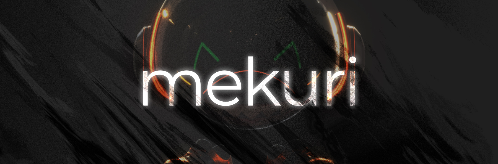

# mekuri



`mekuri` is React package for page transition animations with `wait` and `sync` modes, supporting `popstate` and `scroll restoration`.

Customize animations per component with the `useMekuri` hook and use with libraries like `GSAP`. It integrates with Next.js and Remix; can also be integrated with Next.js `App Router`, but for stable operation it is recommended to use Pages Router rather than App Router.
[Next.js Pages Router demo](https://github.com/FunTechInc/mekuri-demo-pages)

```bash
$ npm i @funtech-inc/mekuri
```

<p align="middle">
  <a href="https://mekuri.vercel.app/"></a>
  <a href="https://mekuri.vercel.app/"></a>
</p>

### Features 📕

-  `wait` and `sync` modes
-  `scrollRestoration` in popstate.
-  When in `sync` mode, routing is possible in `wait` mode when in popstate.
-  Supports frameworks such as `Next.js` and `Remix`. Can also integrate with `Next.js App Router`.
-  `useMekuri` hook for each component.
-  Integration into smooth scrolling libraries such as [lenis](https://github.com/darkroomengineering/lenis) is also possible.

# Usage

```tsx
export default function App({ Component, pageProps }: AppProps) {
   const { pathname } = useRouter();
   return (
      <MekuriContext trigger={pathname}>
         <SomeAnimationComponent>
            <Mekuri>
               <Component
                  key={`${pathname + performance.now()}`}
                  {...pageProps}
               />
            </Mekuri>
         </SomeAnimationComponent>
      </MekuriContext>
   );
}
```

## MekuriContext

The context to wrap the whole thing in. Set the `trigger` to a `state` to switch content. You can use `pathname` if you want to use it as a page transition.

## Mekuri

Unmounting of children can be delayed by wrapping them in a `Mekuri` component.

## useMekuri

Hooks that can be called within `MekuriContext`. Callbacks include `onOnce`, `onLeave`, `onEnter`, `onAfterSyncEnter`, `onEveryLeave` and `onEveryEnter`.

```tsx
const SomeAnimationComponent = ({
   children,
}: {
   children: React.ReactNode;
}) => {
   const ref = useRef<HTMLDivElement>(null);
   useMekuri({
      onLeave: (props: MekuriCallbackProps) => {
         gsap.to(ref.current, {
            opacity: 0,
         });
      },
      onEnter: (props: MekuriCallbackProps) => {
         gsap.to(ref.current, {
            opacity: 1,
         });
      },
   });
   return <div ref={ref}>{children}</div>;
};
```

Each callback has `MekuriCallbackProps` as an argument.

```ts
type MekuriCallbackProps = {
   prevTrigger: Trigger | null | undefined;
   currentTrigger: Trigger | null | undefined;
   nextTrigger: Trigger | null | undefined;
   /** Returns the Y position before leaving the page */
   yPosBeforeLeave: number;
   /** If # is attached to the URL when transitioning, the distance to that ID is returned. */
   getHashPos: ReturnHashPosReturn;
   /** intersectionObserver (
      targetRef: React.RefObject<HTMLElement>,
      callback: (isIntersecting: boolean) => void
   ) => void
 * */
   intersectionObserver: HandleIntersectionObserver;
   /** mekuri renders based on timeout. Therefore, there are cases where the next component is rendered before the chunked Stylesheet updated by Next.js is loaded. `onStylesheetLoad` ensures that functions are executed after the Stylesheet is loaded. `onStylesheetLoad` ensures that the function is executed after the Stylesheet is loaded */
   onStylesheetLoad: (callback: () => void) => void;
   /**  Whether the transition is by popstate */
   isPopstate: boolean;
};
```

## useMekuriDuration

It is possible to receive the `duration` set in the `MekuriContext`.

```tsx
const { millisecond, second } = useMekuriDuration();
```

## useMekuriTrigger

`phase` : `enter` | `leave` , Specify the phase to subscribe to trigger updates

```tsx
const trigger = useMekuriTrigger(phase);
```

# integrate with Next.js App Router

Since the key cannot be obtained by changing children during app router page transition, it is necessary to import `LayoutRouterContext` from next and pass the context to `MekuriFreezer`.

For more information on `App Router` page transition animations, see the following issue.
[See this issue](https://github.com/vercel/next.js/issues/49279#issuecomment-1675782002)

## MekuriFreezer

```tsx
"use client";
import { MekuriFreezer, Mekuri } from "@/packages/mekuri/src";
// import { LayoutRouterContext } from "next/dist/shared/lib/app-router-context";
// Next.js ^13.5.2
import { LayoutRouterContext } from "next/dist/shared/lib/app-router-context.shared-runtime";
import { usePathname } from "next/navigation";

export const PageTransitionLayout = ({
   children,
}: {
   children: React.ReactNode;
}) => {
   const pathname = usePathname();
   return (
      <Mekuri>
         <MekuriFreezer
            key={`${pathname + performance.now()}`}
            routerContext={LayoutRouterContext}>
            {children}
         </MekuriFreezer>
      </Mekuri>
   );
};
```

# integrate with Remix

```tsx
export default function App() {
   const location = useLocation();
   const outlet = useOutlet();
   return (
      <html lang="en" className="h-full">
         <head></head>
         <body className="h-full">
            <MekuriContext trigger={location.pathname}>
               <SomeAnimationComponent>
                  <Mekuri>
                     <div key={location.pathname}>{outlet}</div>
                  </Mekuri>
               </SomeAnimationComponent>
            </MekuriContext>
            <ScrollRestoration />
            <Scripts />
            <LiveReload />
         </body>
      </html>
   );
}
```
